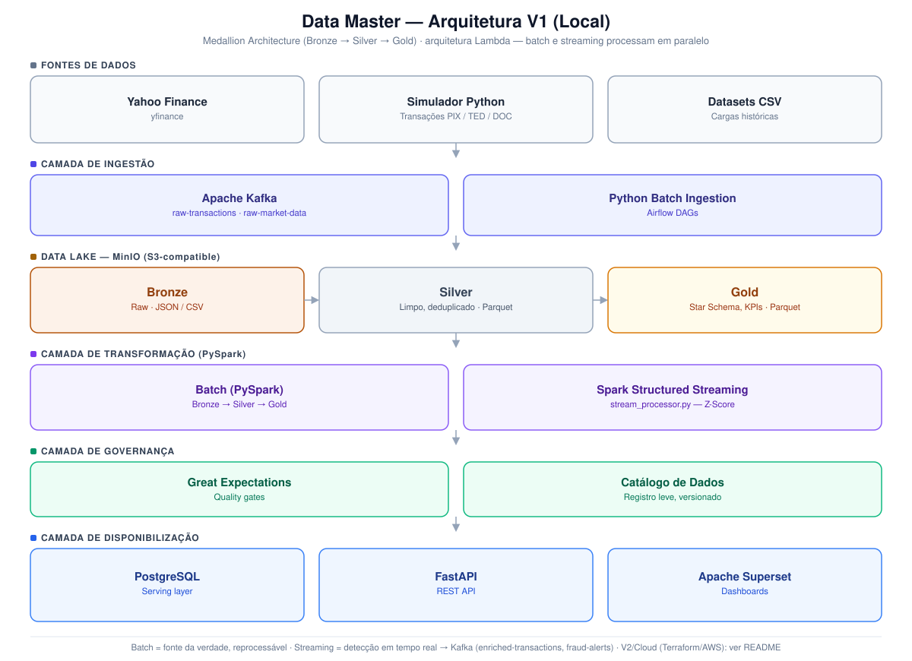
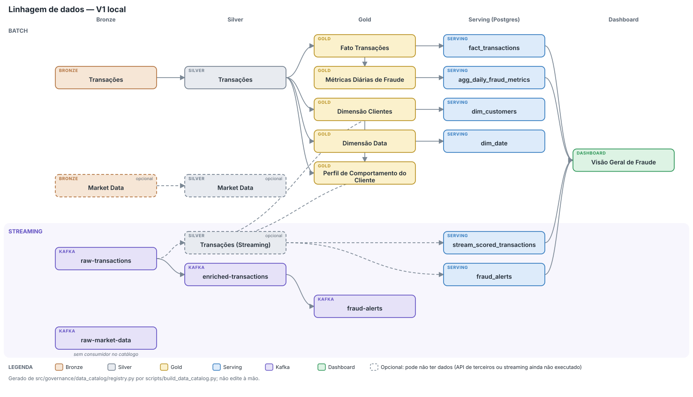

# Data Master — Financial Fraud Detection Platform

[](https://github.com/gpgomes/data-master-std-fraud/actions/workflows/ci.yml)
[](https://www.python.org/downloads/)
[](https://spark.apache.org/)
[](https://kafka.apache.org/)
[](https://airflow.apache.org/)
[](https://docs.docker.com/compose/)
[](LICENSE)

Plataforma de dados end-to-end para ingestão, transformação, governança e visualização de dados financeiros com foco em **detecção de fraudes em transações**. Arquitetura Medallion (Bronze → Silver → Gold) com processamento batch e streaming simultâneos.

---

## Visão Geral

**Cenário de negócio:** Uma instituição financeira precisa consolidar dados de mercado em tempo real (cotações, trades) com dados transacionais internos (pagamentos, transferências via PIX/TED/DOC) para detectar fraudes, gerar dashboards analíticos e cumprir requisitos regulatórios de governança e linhagem de dados.

### Arquitetura

<p align="center">
  
</p>

Reflete o estado real implementado (não o plano original) — ver a tabela "Decisões Arquiteturais" em [`docs/architecture.md`](docs/architecture.md) para o porquê de cada desvio (ex.: Delta Lake avaliado e descartado na issue #9, OpenMetadata descoped para catálogo leve na issue #14, Grafana descoped na issue #16).

---

## Stack Tecnológico

### V1 — Desenvolvimento Local

| Camada | Tecnologia | Função |
|--------|-----------|--------|
| Ingestão Streaming | Apache Kafka (Docker) | Message broker para eventos em tempo real |
| Ingestão Batch | Python + yfinance | Coleta de dados via API e CSVs |
| Orquestração | Apache Airflow (Docker) | Agendamento e monitoramento de DAGs |
| Processamento Batch | PySpark (local mode) | Transformações Bronze → Silver → Gold |
| Processamento Streaming | Spark Structured Streaming | Consumo do Kafka e detecção de fraudes |
| Armazenamento | MinIO (Docker) | Object storage compatível com S3 |
| Serving Layer | PostgreSQL | Consulta analítica das camadas Gold (issue #10) e da saída do streaming, `fraud_score` e alertas (issue #38) |
| Qualidade de Dados | Great Expectations | Validações e expectativas nos dados |
| Catálogo/Linhagem | Catálogo de dados leve (`docs/data_catalog.md`) | Registro versionado + linhagem, validado contra a infra real (issue #14) |
| Visualização | Apache Superset | Dashboards analíticos (Grafana descoped da V1 local — issue #16) |
| Containerização | Docker + Docker Compose | Toda a infra local containerizada |
| Linguagem | Python 3.11+ | Toda a lógica de negócio |

### V2 — Cloud AWS

| Camada | Tecnologia |
|--------|-----------|
| Streaming | Amazon MSK (Managed Kafka) |
| Batch | AWS Lambda + EventBridge |
| Orquestração | Amazon MWAA (Managed Airflow) |
| Processamento | AWS EMR (Spark) |
| Armazenamento | Amazon S3 |
| Serving | Amazon Athena + Redshift Serverless |
| Catálogo | AWS Glue Data Catalog |
| Visualização | Amazon QuickSight |
| IaC | Terraform |
| CI/CD | GitHub Actions |

---

## Estrutura do Repositório

```
data-master-std-fraud/
├── README.md
├── docker-compose.yml              # Orquestração de todos os serviços
├── .env.example                    # Variáveis de ambiente (copie para .env)
├── Makefile                        # Comandos úteis
├── pyproject.toml                  # Configuração Python e dependências
│
├── src/                            # Código-fonte principal
│   ├── ingestion/
│   │   ├── batch/                  # Coleta batch via APIs e CSVs
│   │   └── streaming/              # Kafka producers
│   ├── transformation/
│   │   ├── batch/                  # PySpark jobs (Bronze→Silver→Gold)
│   │   └── streaming/              # Spark Structured Streaming + detecção de fraude
│   ├── serving/
│   │   ├── api/                    # FastAPI REST API
│   │   ├── loaders/                # Carregadores Gold→PostgreSQL
│   │   └── dashboards/             # Provisionamento do dashboard Superset (issue #16)
│   ├── governance/
│   │   ├── great_expectations/     # Suites de qualidade de dados
│   │   └── data_catalog/           # Catálogo leve: registro, validação, render (issue #14)
│   └── common/                     # Utilitários compartilhados
│       ├── config.py               # Configurações centralizadas
│       ├── logger.py               # Logger estruturado
│       └── schemas.py              # Schemas Pydantic / PySpark
│
├── dags/                           # Airflow DAGs
├── dashboards/                     # Dashboard Superset versionado (issue #16) — grafana/ não usado na V1
├── docker/                         # Dockerfiles customizados
├── terraform/                      # IaC para AWS (V2)
├── tests/
│   ├── unit/                       # Testes unitários
│   ├── integration/                # Testes de integração
│   └── conftest.py
├── scripts/                        # Scripts de setup e utilitários
└── docs/                           # Documentação adicional
```

---

## Setup Local

### Pré-requisitos

- Docker Desktop 24+ com Docker Compose v2
- Python 3.11+
- Java 17 (JDK) — necessário para `make test-unit`/`make test`, que rodam PySpark em modo local
- Make (GNU Make)
- Docker Desktop com **12 GB de memória** alocados (Settings → Resources → Memory) e ao menos 16 GB de RAM na máquina.
  Com ~8 GB, a stack completa mais um job Spark batch (principalmente com producers/streaming rodando) faz o OOM killer
  encerrar o executor (`Command exited with code 137`); veja Troubleshooting em [`docs/runbook.md`](docs/runbook.md)

### Início Rápido

```bash
# 1. Clonar o repositório
git clone https://github.com/gpgomes/data-master-std-fraud.git
cd data-master-std-fraud

# 2. Configurar variáveis de ambiente
cp .env.example .env

# 3. Subir toda a infraestrutura
make up

# 4. Aguardar os serviços ficarem prontos (~2 min) e inicializar
make setup

# 5. Gerar dados de exemplo
make seed-data

# 6. Executar pipeline batch (Bronze → Silver, depois Silver → Gold)
make spark-submit-batch
make spark-submit-silver-gold

# 7. Carregar o Gold no Postgres (serving layer)
make spark-submit-gold-postgres

# 8. Iniciar streaming (em outro terminal) e, depois de alguns minutos, carregar a saída dele no Postgres
make spark-submit-stream
make spark-submit-stream-postgres   # o streaming ocupa o cluster: pare-o (Ctrl+C) antes

# 9. Gerar o catálogo de dados e provisionar os dashboards
make catalog
make dashboards

# 10. Subir a API REST (em outro terminal)
make api
```

Depois desses passos: Superset em http://localhost:8088 (dashboard "Fraude e Transações - Visão Geral"), API em http://localhost:8000/docs, catálogo gerado em `docs/data_catalog.md`.

### Acessos Locais

| Serviço | URL | Credenciais |
|---------|-----|-------------|
| Kafka UI | http://localhost:8080 | — |
| MinIO Console | http://localhost:9001 | minioadmin / minioadmin |
| Airflow | http://localhost:8082 | admin / admin |
| Superset | http://localhost:8088 | admin / admin |
| API (Swagger) | http://localhost:8000/docs | — |
| Spark UI | http://localhost:8081 | — |

> **Atenção:** essas credenciais (e as chaves fixas do `docker-compose.yml`, como a Fernet key do Airflow) são **apenas para desenvolvimento local**. Nunca use em produção/AWS: gere credenciais e chaves próprias.

O catálogo de dados não é um serviço web — é gerado como documento versionado, ver [`docs/data_catalog.md`](docs/data_catalog.md) e a seção [Governança de Dados](#governança-de-dados) abaixo.

### Comandos Make Disponíveis

```bash
# Infraestrutura
make up                        # Subir toda a infraestrutura local
make down                      # Derrubar todos os containers
make setup                     # Inicializar buckets MinIO e tópicos Kafka
make ps                        # Listar containers em execução
make logs                      # Logs de todos os serviços (make logs-kafka, logs-postgres, ... para um serviço específico)
make help                      # Listar todos os alvos com descrição (padrão ao rodar `make` sem argumentos)

# Desenvolvimento
make install                   # Instalar dependências de desenvolvimento
make lint                      # Verificar código com ruff e mypy
make format                    # Formatar código com black e ruff

# Testes
make test                      # Executar todos os testes (requer infra)
make test-unit                 # Só os testes unitários (sem infra Docker)
make test-integration          # Só os testes de integração (requer infra)
make test-cov                  # Testes com relatório de cobertura HTML (htmlcov/)

# Pipeline
make seed-data                  # Gerar dados sintéticos de transações e mercado
make spark-submit-batch         # Job PySpark Bronze → Silver (Gold é um job separado)
make spark-submit-silver-gold   # Job PySpark Silver → Gold
make spark-submit-gold-postgres # Carregar Gold no Postgres (serving layer)
make spark-submit-stream        # Job PySpark streaming (Kafka → Silver + detecção de fraude)
make producer-transactions      # Iniciar producer de transações financeiras
make producer-market            # Iniciar producer de dados de mercado

# Serving, governança e dashboards
make api                       # Iniciar a API FastAPI em modo desenvolvimento
make catalog                   # Gerar docs/data_catalog.md e docs/images/data_lineage.svg, e validar os datasets contra a infra real
make dashboards                # Provisionar o dashboard Superset de KPIs (+ smoke test)
make dashboards-export         # Exportar o dashboard provisionado para dashboards/superset/dashboard_configs/

# Limpeza
make clean                     # Limpar volumes Docker, dados temporários e artefatos de build
make clean-data                # Limpar só os dados gerados (mantém os containers)
```

---

## CI/CD

O workflow [`.github/workflows/ci.yml`](.github/workflows/ci.yml) roda automaticamente em todo push/PR para `main` (e pode ser disparado manualmente via `workflow_dispatch`), com dois jobs em paralelo:

| Job | O que roda | Equivalente local |
|-----|-----------|---------------------|
| `lint` | `ruff check` + `mypy` | `make lint` |
| `test` | Testes unitários (`tests/unit/`), com o gate de cobertura ≥70% já configurado em `pyproject.toml` | `make test-unit` |

O job `test` usa Python 3.11 + Java 17 (PySpark roda em modo local `local[*]`, sem precisar do cluster Spark real). O relatório de cobertura HTML é publicado como artefato do workflow.

**Testes de integração (`tests/integration/`) não rodam no CI** — dependem do stack Docker completo (Kafka, Zookeeper, Airflow, Superset, Postgres, MinIO, cluster Spark), pesado demais para rodar em todo PR; ver `docs/runbook.md` para rodá-los localmente com `make up && make setup`.

Antes de abrir um PR, reproduza o gate localmente:
```bash
make lint
make test-unit
```

---

## Detalhamento dos Dados

### Tópicos Kafka

| Tópico | Descrição | Producer |
|--------|-----------|---------|
| `raw-transactions` | Transações financeiras em tempo real | kafka_producer_transactions.py |
| `raw-market-data` | Cotações e trades de mercado | kafka_producer_market.py |
| `enriched-transactions` | Transações enriquecidas com score | stream_processor.py |
| `fraud-alerts` | Alertas de transações fraudulentas (Z-Score) | stream_processor.py |

### Camadas do Data Lake

| Camada | Formato | Particionamento | Conteúdo |
|--------|---------|----------------|---------|
| Bronze | JSON / CSV | `year/month/day` | Dados raw sem transformação |
| Silver | Parquet | `year/month/day` | Dados limpos, deduplicados, tipados |
| Gold | Parquet | Por domínio | Agregações, Star Schema, KPIs |

### Tipos de Fraude Detectados

- **ACCOUNT_TAKEOVER** — Acesso e operações por terceiros na conta
- **CARD_CLONING** — Uso de cartão clonado em localização diferente
- **IDENTITY_THEFT** — Operações com dados de identidade roubados
- **MONEY_LAUNDERING** — Padrão de lavagem (smurfing, layering)
- **SOCIAL_ENGINEERING** — Fraude via engenharia social (PIX falso)

---

## Governança de Dados

### Great Expectations — Quality Gates

- **Bronze:** Schema validation, completude de campos obrigatórios, freshness check
- **Silver:** Unicidade de chaves, ranges de valores, consistência referencial
- **Gold:** Integridade de agregações, SLAs de atualização

Os gates de `bronze_market_data` e `silver_market_data` são **opcionais**: o dado de
mercado vem de uma API gratuita de terceiros (yfinance) sujeita a rate limit, então a
falta dele vira warning e não bloqueia o pipeline. Os demais bloqueiam.

Os **data docs** (HTML navegável com o resultado de cada suite) não são versionados
(`gx/uncommitted/` é ignorado pelo git): só existem depois de rodar um gate. Para gerar
e abrir, veja [`docs/runbook.md`](docs/runbook.md#gerar-e-abrir-os-data-docs).

### Catálogo de Dados — issue #14

O case original previa OpenMetadata (server + MySQL/Postgres próprio +
Elasticsearch + ingestion-Airflow) para catálogo e linhagem. Descoped da V1
local: esse stack soma mais 3-4 serviços pesados aos 19 que já rodam no
`docker-compose.yml` (Kafka, Zookeeper, Spark x3, Airflow x3, Superset,
Postgres x2, MinIO x2, producers, API), competindo pela memória do
Docker (~8GB na época desta decisão; a recomendação atual é 12GB, ver Pré-requisitos). Um catálogo real (OpenMetadata ou um equivalente
gerenciado, ex. AWS Glue Data Catalog) fica para V2/cloud.

No lugar, `src/governance/data_catalog/` mantém um registro declarativo dos
datasets, validado contra a infra real (MinIO/Postgres/Kafka) e renderizado
em [`docs/data_catalog.md`](docs/data_catalog.md) via `make catalog`:

- Catálogo de todos os datasets (Bronze, Silver, Gold, Postgres, Kafka) com owner e tags de classificação (PII, Confidencial, Público)
- Linhagem: fonte → Bronze → Silver → Gold → Serving → Dashboard (mais o caminho do streaming, do Kafka às tabelas `stream_scored_transactions`/`fraud_alerts`), como imagem SVG e como diagrama Mermaid
- Business Glossary: já documentado em [`docs/data_dictionary.md`](docs/data_dictionary.md) (VWAP, Volatilidade, Fraud Score, Z-Score, etc.) — o catálogo referencia esses termos por dataset, sem duplicar as definições
- Validação real: cada asset é checado contra o MinIO/Postgres/Kafka rodando (`make catalog`, ou `--strict` para falhar caso algo não bata) — não é um documento estático

<p align="center">
  
</p>

A imagem é gerada do próprio registro (`make catalog`, Python puro, sem Graphviz nem mermaid-cli) e um teste falha se ela ficar desatualizada em relação ao catálogo.

---

## Dashboards (Superset) — issue #16

**Só Superset na V1** (Grafana descoped): o Superset já roda no `docker-compose.yml`, conectado ao mesmo PostgreSQL da serving layer (issue #10), e cobre 100% dos KPIs pedidos sem precisar de outro container ou datasource — não há nenhum store de séries temporais (Prometheus etc.) que justifique Grafana para métricas real-time. `dashboards/grafana/` permanece como scaffold não usado.

`src/serving/dashboards/` provisiona, de forma idempotente (via API REST do Superset), a conexão com o Postgres, os datasets (`fact_transactions`, `agg_daily_fraud_metrics`) e o dashboard **"Fraude e Transações - Visão Geral"**:

- KPIs: Volume de Transações, Valor Total (R$), Taxa de Fraude (%), Alertas de Fraude
- Séries temporais: Volume diário por tipo de transação, Taxa de fraude diária (%)
- Distribuição de fraude por `fraud_type`
- Filtros nativos de período (`date_key`) e tipo de transação (`transaction_type`)

```bash
make dashboards          # provisiona + roda o smoke test contra cada chart
make dashboards-export   # snapshot versionado em dashboards/superset/dashboard_configs/
```

**Streaming na serving layer (issue #38)**: o `fraud_score` do batch (`fact_transactions`) segue `NULL` por definição (só o streaming o calcula), mas a saída do detector é carregada no Postgres em `stream_scored_transactions` (scores, `z_score`, latência evento→processamento) e `fraud_alerts` (os mesmos alertas do tópico Kafka), com `make spark-submit-stream-postgres` (também é a última task da DAG `batch_transformation_pipeline`). `GET /alerts` devolve esses alertas reais, e o dashboard ganhou latência média, alertas do detector, distribuição de `fraud_score` e alertas por hora.

### Limitações conhecidas da V1

| Limitação | Causa | Referência |
|-----------|-------|------------|
| A serving layer reflete o streaming com a defasagem da última carga (`make spark-submit-stream-postgres` ou a DAG), e `fact_transactions.fraud_score` (batch) continua nulo | O loader lê o Parquet do streaming em batch em vez de consumir o Kafka (o streaming já ocupa todos os cores do cluster local) | [#38](https://github.com/gpgomes/data-master-std-fraud/issues/38) |
| Ao derrubar/reiniciar o streaming no meio de um micro-batch, mensagens de `enriched-transactions`/`fraud-alerts` podem repetir numa janela residual (o Parquet em `silver/transactions_stream/` não duplica) | O Kafka sink do Spark não é transacional (at-least-once); consumidores devem deduplicar por `transaction_id`. Ver [`docs/runbook.md`](docs/runbook.md#semântica-de-entrega-do-streaming-issue-36) | [#36](https://github.com/gpgomes/data-master-std-fraud/issues/36) |
| Sem dados de mercado (`bronze/market_data` vazio); gates e catálogo tratam como opcional | O Yahoo Finance devolve HTTP 429 (rate limit) conforme o IP; a coleta via yfinance não é confiável | [`docs/runbook.md`](docs/runbook.md#quality-gates-great-expectations) |
| Batch e streaming não rodam juntos no cluster Spark padrão | O streaming ocupa os 4 cores e 4 GB dos workers | [`docs/runbook.md`](docs/runbook.md#troubleshooting) |
| MSK, EMR, MWAA, Glue/Athena, QuickSight e deploy automatizado ainda não estão na AWS | V2 em andamento: o esqueleto Terraform (bootstrap da conta, S3, IAM, Budget de US$ 50/mês, CI) está pronto; os módulos de compute e a portabilidade do código para a AWS ainda não. Ver [`docs/runbook.md`](docs/runbook.md#infraestrutura-aws-terraform) | [#17](https://github.com/gpgomes/data-master-std-fraud/issues/17) |

---

## Contribuição

Este projeto segue o fluxo de desenvolvimento por fases descrito em `CaseFinancialDataLakeHouse.md` (junto com `prompts_data_master.md`, é o **briefing original, congelado**: não reflete o estado atual; para isso, veja este README, `docs/architecture.md` e `docs/test_status.md`). Para contribuir, abra uma issue ou pull request referenciando a fase correspondente.

---

## Licença

MIT License — veja [LICENSE](LICENSE) para detalhes.
