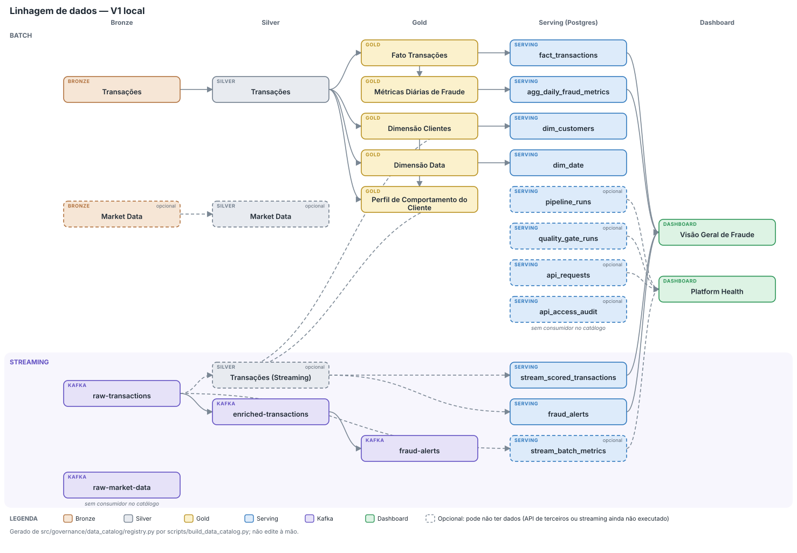

# Arquitetura — Data Master: Financial Fraud Detection Platform

## Visão Geral

A plataforma segue a **Medallion Architecture** (Bronze → Silver → Gold) com suporte a processamento batch e streaming simultâneos.

## Padrão Arquitetural: Lambda

O desenho batch + streaming rodando em paralelo sobre a mesma base de dados (ver "Fluxo de Dados" abaixo) é uma **arquitetura Lambda**:

- **Batch layer** — `bronze_to_silver.py` / `silver_to_gold.py` (PySpark). Reprocessa o histórico completo (ou grandes intervalos via `--start-date/--end-date`) com alta acurácia e latência de minutos. É a fonte da verdade: se a lógica de streaming tiver um bug ou perder eventos, o batch corrige no próximo run, pois sempre reprocessa a partir do dado bruto no Bronze.
- **Speed layer** — Spark Structured Streaming consumindo `raw-transactions` do Kafka, com detecção de fraude em tempo real (segundos) pelo Fraud Engine multi-signal, que lê o perfil dos clientes calculado pelo batch e calcula só as janelas curtas (ver "Detecção de fraude" abaixo). Cobre a janela entre a última execução batch e o presente, mas com garantias mais fracas de completude/correção.
- **Serving layer** — PostgreSQL (Gold, batch) + Kafka `fraud-alerts` (streaming) + FastAPI, que expõem as duas visões para quem consome — dado histórico consolidado (batch) e alertas em tempo real (streaming).

**Por que Lambda e não Kappa?** A arquitetura Kappa elimina a camada batch e trata tudo como stream reprocessável (replay do log do zero quando a lógica muda), reduzindo a duplicação de lógica de negócio entre duas pipelines. Ela foi considerada, mas descartada por dois motivos:
1. **Auditoria/regulatório** — transações financeiras (PIX/TED/DOC) exigem uma trilha batch reprocessável e fácil de auditar; um único pipeline streaming faz esse papel com mais fricção operacional.
2. **Custo de retenção no Kafka** — Kappa exige retenção longa (ou ilimitada) no tópico para permitir replay completo do histórico; no cenário deste projeto isso é mais caro/complexo do que reprocessar Parquet no Bronze via batch.

**Trade-off aceito**: mantemos duas implementações da lógica de transformação (batch em PySpark batch job, streaming em Spark Structured Streaming) — a "dualidade de código" clássica da Lambda. É mitigado parcialmente reaproveitando os mesmos schemas (`src/common/schemas.py`) e configurações (`src/common/config.py`) entre as duas camadas.

## Fluxo de Dados

### Batch
```
yfinance / CSV → Python Collector → MinIO (Bronze/Parquet)
                                         ↓
                              PySpark Bronze→Silver Job
                                         ↓
                              MinIO (Silver/Parquet)
                                         ↓
                              PySpark Silver→Gold Job
                                         ↓
                              MinIO (Gold/Parquet) → PostgreSQL
                                (inclui gold/customer_behavior_profile/,
                                 o perfil que o streaming lê por broadcast)
```

Orquestrado por duas DAGs Airflow em sequência: `batch_ingestion_pipeline`
(06:00 UTC, fontes → Bronze → gate de qualidade) e
`batch_transformation_pipeline` (07:00 UTC, Bronze → Silver → gate → Gold →
gate → PostgreSQL, via `SparkSubmitOperator` intercalado com os quality
gates do Great Expectations, issue #13 — ver seção "Quality Gates" em
`docs/runbook.md`). O loader Gold→PostgreSQL
(`src/serving/loaders/gold_to_postgres.py`, issue #10) roda como a
penúltima task da segunda DAG, truncate+reload por tabela.

### Streaming
```
Simulador Python → Kafka (raw-transactions)
                        ↓
              Spark Structured Streaming
                        ↓
   Fraud Engine V2 (perfil do Gold por broadcast + estado curto de 6 h);
   Z-Score V1 em paralelo, só como shadow
                        ↓
    MinIO Silver (silver/transactions_stream/, distinto do
    silver/transactions/ do batch) + Kafka (enriched-transactions,
    todas as linhas pontuadas) + Kafka (fraud-alerts, só as que o V2 marcou)
```

**Semântica de entrega (issue #36):** o Spark reexecuta o mesmo micro-batch se o job cair antes de gravar o commit do checkpoint, e o `foreachBatch` escreve em vários destinos sem transação. Por isso cada etapa é idempotente ou pulada no replay: o Parquet é gravado em `silver/transactions_stream/query_id=<id>/batch_id=<n>/` com overwrite dinâmico da própria partição, e cada etapa (parquet, enriched, alerts, estado curto) grava um marcador em `checkpoints/stream_processor_progress/` que faz o replay pulá-la. O `alert_id` é derivado de `transaction_id`, então um alerta reprocessado mantém o mesmo id. Garantia final: **at-least-once nos tópicos Kafka** (o Kafka sink do Spark não é transacional; cair entre o fim de uma etapa Kafka e a escrita do seu marcador ainda pode duplicar aquela mensagem, uma janela de milissegundos) e **sem duplicatas no Parquet**. Consumidores devem deduplicar por `transaction_id`.

**Serving do streaming (issue #38):** `stream_to_postgres.py` lê `silver/transactions_stream/` e carrega `stream_scored_transactions` (uma linha por `transaction_id`, com o veredito do V2 em `fraud_score`, `is_fraud_predicted`, `fraud_signals` e `fraud_type_predicted`, o Z-Score antigo em paralelo em `z_score` e `is_anomaly`, o **rótulo** do gerador em `is_fraud`/`fraud_type` e `latency_seconds = processing_timestamp - produced_at`) e `fraud_alerts` (os alertas, reconstruídos com a mesma função do detector, então o `alert_id` é idêntico ao do tópico `fraud-alerts`, e com os sinais que os dispararam, issue #47). É um loader batch (truncate + reload, também a última task da DAG `batch_transformation_pipeline`) e não um consumidor Kafka, porque o streaming já ocupa todos os cores do cluster local. Só as colunas úteis vão ao Postgres: `device_id`, `ip_address`, contas e coordenadas ficam de fora.

### Linhagem de dados

<p align="center">
  
</p>

Gerada de `src/governance/data_catalog/registry.py` por `make catalog` (a mesma fonte do `docs/data_catalog.md`), então mostra exatamente o que o catálogo declara: o fluxo batch, o fluxo de streaming (Kafka, Silver do streaming e as tabelas `stream_scored_transactions` e `fraud_alerts`) e os datasets opcionais tracejados. Ver o runbook, seção "Catálogo de Dados".

## Detecção de fraude (Fraud Engine)

Até a issue #45 o detector era um Z-Score do valor por cliente, e o `fraud_type` do alerta era copiado do rótulo do gerador (com um tipo fixo de fallback). Não dava para responder "onde detecta clonagem de cartão?" nem "qual a Precision?". A série de issues #43 a #47 trocou isso por um detector **medido**: gerador de dados com comportamento por cliente, harness de avaliação, o Fraud Engine e a integração no stream.

### Por que a Lambda se justifica aqui

O que é "normal" para um cliente (valor típico, devices, redes, destinatários frequentes, horário, cidade) só se aprende olhando meses de histórico: é trabalho de **batch**. O que precisa de segundos (a rajada de transações, a viagem que nenhum avião faz, cinco remetentes para a mesma conta em uma hora) só existe na **janela curta**: é trabalho do **stream**.

| Camada | O que calcula | Onde vive | Custo |
|--------|---------------|-----------|-------|
| Batch (longa) | Perfil de comportamento por cliente | `gold/customer_behavior_profile/`, recalculado por `silver_to_gold.py` (~30 s para 500 mil transações) | Varre o histórico, roda uma vez por execução |
| Stream (curta) | Velocidade, viagem impossível e concentração de destinatários | Estado de 6 h em `silver/_stream_state/recent_events/` | Lê o perfil por broadcast e o estado curto a cada micro-batch |

O custo clássico da Lambda, a lógica duplicada entre batch e stream, é o núcleo puro `src/transformation/fraud/` (`DataFrame → DataFrame`, sem UDF Python) chamado pelos dois caminhos, mais um **teste de paridade**: o dataset inteiro de uma vez dá o mesmo score, sinais e tipo que o mesmo dataset em micro-batches com o estado persistido entre eles.

### Como o score é calculado

Dez sinais em [0, 1], cada um com um peso `wᵢ` calibrado, combinados por noisy-OR: `score = 1 − Π(1 − wᵢ·sᵢ)`. O alerta dispara quando o score passa do limiar (`src/transformation/fraud/weights.py`, gerado por `make fraud-calibrate`). Os sinais estão descritos em `docs/data_dictionary.md` (seção "Sinais do Fraud Engine"). O tipo do alerta é inferido por regras com prioridade sobre os sinais (`fraud_type.py`); se nenhuma casa, o alerta fica sem tipo.

**Como o limiar foi definido.** O ponto de operação declarado é *recall máximo com FPR ≤ 1%*, calibrado numa seed de validação e aplicado sem ajuste em 5 seeds de teste diferentes, com clientes diferentes (os pesos são congelados antes de olhar as seeds de teste). O relatório traz a sensibilidade a 0,5%, 1% e 2%.

### O detector não vê o rótulo

`is_fraud`/`fraud_type` são o ground truth do gerador sintético e viajam no payload do Kafka (a avaliação online precisa deles). Por isso o `_score_batch` os separa do DataFrame **antes** de qualquer detector e só os junta de volta, por `transaction_id`, no fim; o núcleo puro seleciona uma lista explícita de colunas (`EVENT_COLUMNS`) e uma guarda estática garante que nenhum módulo dele cita `is_fraud` ou `fraud_type`. Um teste roda o mesmo micro-batch com o rótulo verdadeiro, invertido e nulo e exige score, sinais, tipo e alerta idênticos. No Postgres a distinção aparece nos nomes: `is_fraud`/`fraud_type` são rótulo; `is_fraud_predicted`/`fraud_type_predicted` são predição.

### Shadow scoring

O Z-Score antigo continua calculado nos mesmos eventos (`z_score`, `is_anomaly`, `fraud_score_v1`, `shadow_detector_version`), mas não alerta. É o que permite a comparação online sem risco: os dois vereditos ficam lado a lado em `stream_scored_transactions`, e `make fraud-online-eval` os mede.

### Resultados

**Offline** (`make fraud-eval`, `docs/fraud_evaluation.md`; replay de stream, 1.000 clientes, 5 seeds de teste, média ± desvio, comparação pareada):

| Detector | Precision | Recall | F1 | FPR |
|----------|----------:|-------:|---:|----:|
| `zscore-v1` | 40,7% ± 1,1 | 56,4% ± 1,5 | 47,3% ± 1,2 | 2,21% |
| `multisignal-v2` | 72,7% ± 0,4 | 94,1% ± 0,3 | 82,0% ± 0,4 | 0,95% |

ΔF1 de +34,8 p.p. ± 1,1, com o V2 vencendo em 5 de 5 seeds. Recall do V2 por tipo: `ACCOUNT_TAKEOVER` 100%, `IDENTITY_THEFT` 99,9%, `MONEY_LAUNDERING` 99,1%, `CARD_CLONING` 96,7% (86,5% na variante *stealth*), `SOCIAL_ENGINEERING` 68,2% (0% na *stealth*). O tipo inferido está certo em 76,3% das fraudes alertadas.

**Online** (`make fraud-online-eval`, SQL sobre `stream_scored_transactions`): uma execução limpa de 21 min a ~14 TPS (18.170 eventos, 1.000 clientes, 323 fraudes, 1,8%), com os dois detectores sobre os **mesmos eventos**:

| Detector | Precision | Recall | F1 | FPR | Alertas/1.000 tx |
|----------|----------:|-------:|---:|----:|-----------------:|
| `zscore-v1` (shadow) | 14,2% | 57,6% | 22,8% | 6,30% | 72,2 |
| `multisignal-v2` | 60,0% | 91,3% | 72,4% | 1,10% | 27,1 |

O Recall do V2 por tipo bate com o offline: `ACCOUNT_TAKEOVER` 100%, `CARD_CLONING` 100%, `IDENTITY_THEFT` 100%, `MONEY_LAUNDERING` 97,8%, `SOCIAL_ENGINEERING` 68,6%. O Recall global (91,3%, intervalo de ±3 p.p. com 323 fraudes) e o FPR (1,10%) ficam em torno do offline (94,1% e 0,95%); a Precision é menor porque a prevalência online é de 1,8% e a offline de ~2,6%. O tipo inferido está certo em 69% das fraudes alertadas (76% no offline). **Latência** evento → processamento: p50 5,97 s, p95 10,46 s, p99 10,92 s, contra p50 5,46 s e p95 9,90 s do V1 antes do Fraud Engine: o custo do perfil e do estado de 6 h é de ~0,5 s, e o teto é o trigger de 10 s. Medido também com o estado em regime (346 mil linhas, ~6 h): p95 de 10,38 s. O FPR do Z-Score online (6,3%) é maior que o offline (2,2%); a hipótese é a janela de 1 h com poucas amostras por cliente numa execução curta, e não foi confirmada.

### Onde o detector erra

- **Engenharia social *stealth* (Recall 0%).** Vítima autenticada no próprio device e rede, valor dentro do padrão: só o destinatário novo a separa de um pagamento legítimo, e um destinatário novo sozinho não passa do limiar.
- **Compra grande legítima** é alertada em 21,8% dos casos (`big_purchase`): o valor alto e o destinatário novo somam.
- **Lavagem de dinheiro** é classificada como engenharia social em 39% dos alertas: os primeiros eventos de cada conta-mula têm device conhecido, destinatário novo e valor alto.
- **Os falsos positivos do V2 vêm do destinatário novo.** Na rodada online, 197 de 197 falsos positivos tinham `NEW_DESTINATION` ativo (em 26% do tráfego legítimo o destinatário é novo, e é o sinal de maior peso); o segundo sinal mais frequente entre eles, `TX_VELOCITY`, aparece em 46.

### Ressalva de circularidade

O gerador manda **toda** a fraude para uma conta-destino nova: `NEW_DESTINATION` está ativo em 100% da fraude, e o resultado do V2 é bom demais para ser aceito sem essa ressalva. O relatório dimensiona: sem esse sinal, recalibrado só na validação, o V2 fica com Recall 88,0% e F1 77,7%, e engenharia social cai de 68% para 38%. Os demais sinais também vêm de assinaturas injetadas pelo gerador (valores altos, device novo, viagem impossível, vários remetentes para a mesma conta). O número que importa é o **relativo** (V1 × V2) e a sensibilidade, não os 94%: com dado real o Recall seria menor. Isso é válido tanto para o benchmark offline quanto para o online, que usa o mesmo gerador.

## Componentes

### Ingestão
- **Kafka** — Message broker para streaming de transações e cotações
- **Python Batch** — Coleta dados via yfinance e CSV, salva no Bronze

### Armazenamento
- **MinIO** — Object storage S3-compatible com quatro buckets: bronze, silver, gold, checkpoints (`checkpointLocation` do Spark Structured Streaming — o estado curto entre micro-batches, com as últimas 6 h de eventos, fica em `silver/_stream_state/recent_events/`, não em `checkpoints/`)
- **Parquet** — Formato único de Silver e Gold (issue #9); ver "Decisões Arquiteturais" abaixo

### Transformação
- **PySpark Batch** — Jobs Bronze→Silver e Silver→Gold
- **Spark Structured Streaming** — Processamento em tempo real com detecção de fraude (Fraud Engine, `src/transformation/fraud/`)

### Governança
- **Great Expectations** — Quality gates integrados ao Airflow
- **Catálogo de dados leve** (`src/governance/data_catalog/`) — registro versionado, linhagem e classificação, validado contra a infra real; ver decisão abaixo

### Observabilidade (issue #55)
- **Métricas de plataforma** (`src/observability/`) — stream (via `StreamingQueryListener`), DAGs, quality gates e API, em tabelas append-only no Postgres; dashboard "Platform Health" no Superset e `make slo-report`

### Disponibilização
- **PostgreSQL** — Tabelas Gold para SQL analítico
- **FastAPI** — REST API para consultas e alertas
- **Apache Superset** — Dashboards (provisionado via API REST, `src/serving/dashboards/`; Grafana descoped da V1 — ver decisão abaixo)

## Decisões Arquiteturais

| Decisão | Escolha | Justificativa |
|---------|---------|---------------|
| Padrão batch+streaming | Lambda (não Kappa) | Trilha batch auditável para dados financeiros regulados; evita retenção longa/cara no Kafka que o replay completo do Kappa exigiria |
| Formato de armazenamento | Parquet puro (não Delta Lake) | Silver/Gold são reescritos por completo a cada execução (idempotente via overwrite dinâmico por partição, ver `spark_session.py`), então o log de transação ACID do Delta não agrega valor agora. O Spark session e o Makefile chegaram a configurar extensões Delta (`io.delta:delta-core_2.12:2.4.0`), mas com versão incompatível com o Spark 3.5.1 do cluster (Delta 2.4 é pra Spark 3.4) e nunca de fato usadas (todo `.write` já era `.format("parquet")`) — configuração removida na issue #9. Time travel/versionamento fica para a fase de governança (roadmap 3.6), quando justificar a complexidade extra |
| Schema Registry (#59) | Sem Schema Registry: mensagens em JSON no Kafka; o contrato é um `.avsc` versionado (`src/ingestion/streaming/schemas/`), com teste de compatibilidade Avro × Pydantic × DDL Spark (`test_data_contract.py`) | Um serviço a menos no ambiente local, e o teste pega divergência de campo entre producer e consumidor. Custo: nada impede em tempo de execução um producer de publicar fora do contrato (o Pydantic do producer é a única barreira) e o JSON é maior que Avro binário. Em produção: Schema Registry com Avro binário e compatibilidade BACKWARD |
| Detecção de fraude (issues #43 a #47) | Fraud Engine multi-signal: 10 sinais combinados por noisy-OR, com perfil longo do batch e janela curta no stream. O Z-Score fica como shadow | Precision/Recall/FPR medidos, reprodutíveis e comparados com o Z-Score, no mesmo dado. Interpretável (cada alerta traz os sinais que o dispararam) e sem infra de treino. Ver "Detecção de fraude" abaixo |
| Score do detector | Noisy-OR sobre sinais ponderados, não um modelo treinado | `1 − Π(1 − wᵢ·sᵢ)` fica em [0, 1], é monotônico e dá o motivo do alerta de graça. Um modelo treinado (MLflow/sklearn) pediria infra de treino, versionamento de modelo e mais superfície a defender; fica como evolução |
| Eventos atrasados no stream (#59) | Sem watermark; o evento atrasado é pontuado com o contexto do estado curto | O watermark do Spark só age em operadores com estado, e o stream não tem nenhum antes do `foreachBatch` (o estado é o Parquet de 6 h): declarado, ele não fazia nada. Evento atrasado nunca é descartado; é pontuado contra os eventos que o antecedem em tempo de evento e sai do estado se ficar mais velho que 6 h em relação ao mais recente. Custo: um evento muito atrasado é pontuado com pouco contexto de janela curta |
| Durabilidade do producer (#59) | `acks="all"`, sem producer idempotente | Antes, `acks=1` perdia a mensagem na entrada se o líder caísse antes de replicar. Idempotência não está disponível nos clientes usados (kafka-python 2.0.2 na imagem, kafka-python-ng no host), então um retry pode duplicar: o stream deduplica por `transaction_id` no micro-batch e o loader do Postgres fica com uma linha |
| Rótulo de fraude no stream | `is_fraud`/`fraud_type` seguem no payload do Kafka, separados do DataFrame antes do scoring | Manter o rótulo no payload preserva a avaliação online; separá-lo estruturalmente no `_score_batch` e cobrir com teste de vazamento fecha o risco de o detector ler o rótulo. Tirá-lo do payload (tópico `ground-truth`, o rótulo chegando tarde) seria mais realista e fica como evolução |
| Serving layer | PostgreSQL | Serve a API e o Superset com SQL concorrente. DuckDB chegou a ser dependência para consultas ad-hoc sobre o Parquet, mas nunca foi usado no código e saiu do projeto |
| Escopo do CI (GitHub Actions) | Só lint + testes unitários, sem os testes de integração | `tests/unit/` roda 100% local (SparkSession `local[*]`, storage mockado); o stack completo (Kafka, Zookeeper, Airflow, Superset, Postgres, MinIO, cluster Spark) é pesado/lento demais para rodar em todo PR — ver `.github/workflows/ci.yml` |
| Catálogo/linhagem (issue #14) | Registro leve versionado (não OpenMetadata) | O stack oficial do OpenMetadata (server + MySQL/Postgres próprio + Elasticsearch + ingestion-Airflow) soma mais 3-4 serviços pesados aos 19 que já rodam neste `docker-compose.yml`, disputando os ~8GB alocados ao Docker no ambiente local. `src/governance/data_catalog/` cobre o mesmo objetivo (owners, tags PII, glossário, linhagem) sem subir nenhum container novo, validando cada asset contra MinIO/Postgres/Kafka reais. Um catálogo gerenciado real (OpenMetadata ou AWS Glue Data Catalog, já previsto na V2) fica para a fase cloud |
| Observabilidade da plataforma (issue #55) | Tabelas de métricas no Postgres + dashboard "Platform Health" no Superset + `make slo-report`; não Prometheus + Grafana | Nenhum container novo: o Postgres e o Superset já existem, e o Docker local já está no limite de memória. O stream publica o progresso de cada micro-batch por `StreamingQueryListener` (no driver, gravação direta no Postgres), a API por um middleware que grava depois da resposta, as DAGs por uma task `all_done` e o GX no próprio runner. Gravação de métrica nunca derruba o pipeline. Custo: não há scrape nem alertas em tempo real (o dashboard é consultado, não empurra), e o Postgres de serving passa a guardar dado operacional. Prometheus + Grafana fica para quando houver alerta ativo ou volume que justifique um TSDB |
| Dashboards (issue #16) | Só Superset (Grafana descoped) | Superset já roda no `docker-compose.yml`, conectado ao mesmo Postgres da serving layer (issue #10) — cobre 100% dos KPIs pedidos sem novo container/datasource. Não há store de séries temporais (Prometheus etc.) que justifique Grafana para métricas real-time nesta V1; `dashboards/grafana/` fica como scaffold não usado. `src/serving/dashboards/` provisiona tudo via API REST do Superset (idempotente), com smoke test comparando cada chart contra uma query direta no Postgres. Streaming (issue #38): `stream_scored_transactions` e `fraud_alerts` viram datasets do Superset, com 4 charts opcionais (latência média, alertas do detector, distribuição de `fraud_score`, alertas por hora) que não falham a verificação sem dados de streaming. Nenhum gráfico novo foi criado para o Fraud Engine (issue #47): só as descrições e as colunas dos datasets foram atualizadas |
| Serving do streaming (issue #38) | Loader batch `silver/transactions_stream` → Postgres, não consumidor Kafka | O streaming ocupa os 4 cores do cluster local, então um segundo job de streaming não teria recursos. O Parquet é o registro durável, e como o `alert_id` é determinístico os alertas são reconstruídos com a função do detector, dando exatamente o conteúdo do tópico `fraud-alerts` (conferido: 244 alertas, 0 diferenças de `alert_id`). Custo: a serving layer reflete o streaming com a defasagem da última carga |

## CI/CD

Job `lint` (ruff + mypy) e job `test` (`pytest tests/unit/`, gate de cobertura ≥70%) rodam em paralelo a cada push/PR para `main`, via `.github/workflows/ci.yml`. Reflete só a camada de qualidade de código da futura Fase 6 do roadmap (`CaseFinancialDataLakeHouse.md`, item 6.1) — o deploy automatizado para AWS ainda não existe.
