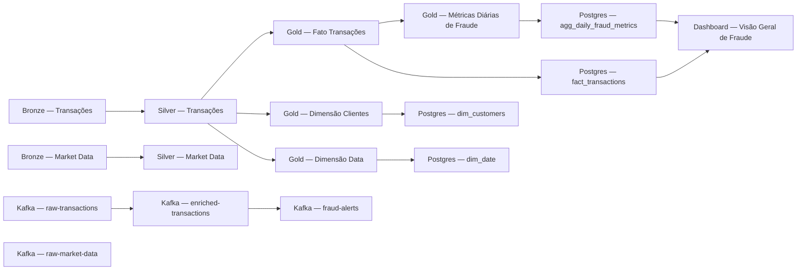

# Catálogo de Dados

_Gerado em 2026-09-23T19:05:20.718509+00:00 por `python -m scripts.build_data_catalog`._

Substitui o OpenMetadata completo na V1 local (decisão documentada em `docs/architecture.md`) — ver definições de campo e o glossário de negócio completo em [`docs/data_dictionary.md`](data_dictionary.md).

## Bronze

| Dataset | Localização | Owner | Classificação | Glossário | Status |
|---------|-------------|-------|---------------|-----------|--------|
| **Bronze — Transações** Transações financeiras raw, conforme recebidas do Kafka. | `s3://bronze/transactions/` | Data Engineering | PII, Confidencial | — | ✅ ok |
| **Bronze — Market Data** Cotações OHLCV coletadas via yfinance. | `s3://bronze/market_data/` | Data Engineering | Público | VWAP, Volatilidade | ⚠️ sem dados (opcional): nenhum objeto encontrado em s3://bronze/market_data/ |

## Silver

| Dataset | Localização | Owner | Classificação | Glossário | Status |
|---------|-------------|-------|---------------|-----------|--------|
| **Silver — Transações** Transações limpas, deduplicadas, timestamps normalizados para UTC. | `s3://silver/transactions/` | Data Engineering | PII, Confidencial | — | ✅ ok |
| **Silver — Market Data** Cotações enriquecidas com retorno diário e price range. | `s3://silver/market_data/` | Data Engineering | Público | VWAP, Volatilidade | ⚠️ sem dados (opcional): nenhum objeto encontrado em s3://silver/market_data/ |

## Gold

| Dataset | Localização | Owner | Classificação | Glossário | Status |
|---------|-------------|-------|---------------|-----------|--------|
| **Gold — Fato Transações** Tabela fato de transações — grão: uma linha por transação. | `s3://gold/fact_transactions/` | Analytics Engineering | PII, Confidencial | Fraud Score | ✅ ok |
| **Gold — Dimensão Clientes** Dimensão de clientes (SCD2, apenas registro corrente). | `s3://gold/dim_customers/` | Analytics Engineering | PII, Confidencial | — | ✅ ok |
| **Gold — Dimensão Data** Dimensão de calendário derivada das datas distintas do Silver. | `s3://gold/dim_date/` | Analytics Engineering | Público | — | ✅ ok |
| **Gold — Métricas Diárias de Fraude** Agregação diária de volume e taxa de fraude por tipo de transação. | `s3://gold/agg_daily_fraud_metrics/` | Analytics Engineering | Confidencial | Fraud Score | ✅ ok |

## Serving (PostgreSQL)

| Dataset | Localização | Owner | Classificação | Glossário | Status |
|---------|-------------|-------|---------------|-----------|--------|
| **Postgres — fact_transactions** Espelho da tabela fato Gold, carregado via truncate+reload (issue #10). | `fact_transactions` | Analytics Engineering | PII, Confidencial | Fraud Score | ✅ ok |
| **Postgres — dim_customers** Espelho da dimensão de clientes Gold. | `dim_customers` | Analytics Engineering | PII, Confidencial | — | ✅ ok |
| **Postgres — dim_date** Espelho da dimensão de calendário Gold. | `dim_date` | Analytics Engineering | Público | — | ✅ ok |
| **Postgres — agg_daily_fraud_metrics** Espelho da agregação diária de fraude Gold, consumido pela API (issue #15). | `agg_daily_fraud_metrics` | Analytics Engineering | Confidencial | Fraud Score | ✅ ok |

## Streaming (Kafka)

| Dataset | Localização | Owner | Classificação | Glossário | Status |
|---------|-------------|-------|---------------|-----------|--------|
| **Kafka — raw-transactions** Transações publicadas em tempo real pelo producer. | `raw-transactions` | Data Engineering | PII, Confidencial | — | ✅ ok |
| **Kafka — raw-market-data** Cotações publicadas em tempo real pelo producer. | `raw-market-data` | Data Engineering | Público | VWAP | ✅ ok |
| **Kafka — enriched-transactions** Transações com fraud_score anexado pelo StreamProcessor (issue #11). | `enriched-transactions` | Data Engineering | PII, Confidencial | Z-Score, Fraud Score | ✅ ok |
| **Kafka — fraud-alerts** Alertas de fraude confirmados pelo detector Z-Score (issue #11). | `fraud-alerts` | Fraud Analytics | PII, Confidencial | Z-Score, Fraud Score, Velocity Check | ✅ ok |

## Dashboards

| Dataset | Localização | Owner | Classificação | Glossário | Status |
|---------|-------------|-------|---------------|-----------|--------|
| **Dashboard — Visão Geral de Fraude** KPIs de volume, valor, taxa de fraude e alertas (Superset — Grafana descoped, issue #16). | `http://localhost:8088/superset/dashboard/fraude-transacoes-visao-geral/` | Fraud Analytics | Confidencial | Fraud Score | — não validado |

## Linhagem

