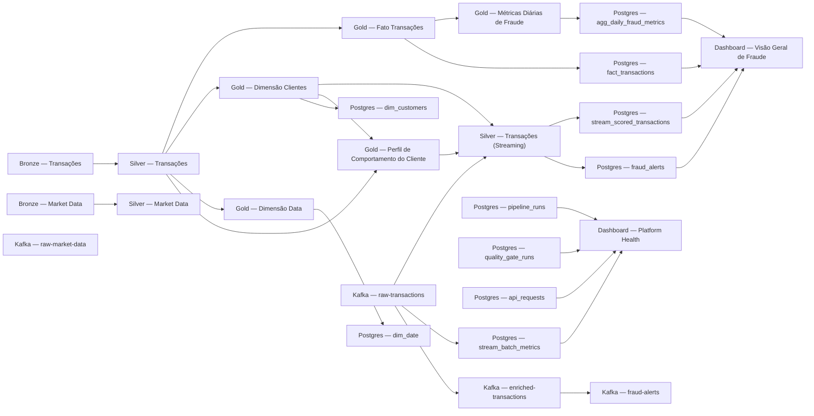

# Catálogo de Dados

_Gerado em 2026-09-27T04:41:43.453353+00:00 por `python -m scripts.build_data_catalog`._

Substitui o OpenMetadata completo na V1 local (decisão documentada em `docs/architecture.md`) — ver definições de campo e o glossário de negócio completo em [`docs/data_dictionary.md`](data_dictionary.md).

## Bronze

| Dataset | Localização | Owner | Classificação | Glossário | Status |
|---------|-------------|-------|---------------|-----------|--------|
| **Bronze — Transações** Transações financeiras raw, conforme recebidas do Kafka. | `s3://bronze/transactions/` | Data Engineering | PII, Confidencial | — | ✅ ok |
| **Bronze — Market Data** Cotações OHLCV coletadas via yfinance. | `s3://bronze/market_data/` | Data Engineering | Público | VWAP, Volatilidade | ⚠️ sem dados (opcional): nenhum objeto encontrado em s3://bronze/market_data/ |

## Silver

| Dataset | Localização | Owner | Classificação | Glossário | Status |
|---------|-------------|-------|---------------|-----------|--------|
| **Silver — Transações** Transações limpas, deduplicadas, timestamps normalizados para UTC. | `s3://silver/transactions/` | Data Engineering | PII, Confidencial | — | ✅ ok |
| **Silver — Market Data** Cotações enriquecidas com retorno diário e price range. | `s3://silver/market_data/` | Data Engineering | Público | VWAP, Volatilidade | ⚠️ sem dados (opcional): nenhum objeto encontrado em s3://silver/market_data/ |
| **Silver — Transações (Streaming)** Saída do detector de streaming, particionada por query_id/batch_id: transações com o veredito do Fraud Engine (fraud_score, is_fraud_predicted, fraud_signals, fraud_type_predicted, detector_version), o Z-Score antigo em paralelo (z_score, is_anomaly, fraud_score_v1) e o rótulo do gerador (is_fraud, fraud_type). Só existe depois que o job de streaming rodou (issues #11 e #46). | `s3://silver/transactions_stream/` | Data Engineering | PII, Confidencial | Fraud Engine, Shadow Scoring, Z-Score, Fraud Score | ✅ ok |

## Gold

| Dataset | Localização | Owner | Classificação | Glossário | Status |
|---------|-------------|-------|---------------|-----------|--------|
| **Gold — Fato Transações** Tabela fato de transações — grão: uma linha por transação. | `s3://gold/fact_transactions/` | Analytics Engineering | PII, Confidencial | Fraud Score | ✅ ok |
| **Gold — Dimensão Clientes** Dimensão de clientes (SCD2, apenas registro corrente). | `s3://gold/dim_customers/` | Analytics Engineering | PII, Confidencial | — | ✅ ok |
| **Gold — Dimensão Data** Dimensão de calendário derivada das datas distintas do Silver. | `s3://gold/dim_date/` | Analytics Engineering | Público | — | ✅ ok |
| **Gold — Métricas Diárias de Fraude** Agregação diária de volume e taxa de fraude por tipo de transação. | `s3://gold/agg_daily_fraud_metrics/` | Analytics Engineering | Confidencial | Fraud Score | ✅ ok |
| **Gold — Perfil de Comportamento do Cliente** Perfil de comportamento por cliente, aprendido do histórico legítimo do Silver: valor típico (μ/σ de ln(amount)), devices, redes /24 e destinatários conhecidos, share noturno, centro geográfico e idade da conta. Grão: uma linha por cliente. É a camada longa da arquitetura Lambda, lida por broadcast pelo detector do streaming (issue #46). Validado pelo gate gold_customer_behavior_profile do Great Expectations (issue #47). | `s3://gold/customer_behavior_profile/` | Fraud Analytics | PII, Confidencial | Perfil de Comportamento, Fraud Engine | ✅ ok |

## Serving (PostgreSQL)

| Dataset | Localização | Owner | Classificação | Glossário | Status |
|---------|-------------|-------|---------------|-----------|--------|
| **Postgres — fact_transactions** Espelho da tabela fato Gold, carregado via truncate+reload (issue #10). | `fact_transactions` | Analytics Engineering | PII, Confidencial | Fraud Score | ✅ ok |
| **Postgres — dim_customers** Espelho da dimensão de clientes Gold. | `dim_customers` | Analytics Engineering | PII, Confidencial | — | ✅ ok |
| **Postgres — dim_date** Espelho da dimensão de calendário Gold. | `dim_date` | Analytics Engineering | Público | — | ✅ ok |
| **Postgres — agg_daily_fraud_metrics** Espelho da agregação diária de fraude Gold, consumido pela API (issue #15). | `agg_daily_fraud_metrics` | Analytics Engineering | Confidencial | Fraud Score | ✅ ok |
| **Postgres — stream_scored_transactions** Transações pontuadas pelo Fraud Engine (fraud_score, is_fraud_predicted, fraud_signals, fraud_type_predicted, detector_version), com o Z-Score antigo em paralelo (z_score, is_anomaly, fraud_score_v1) e a latência evento→processamento. is_fraud/fraud_type são o **rótulo** do gerador (ground truth, só para medir); as colunas *_predicted e fraud_score são a predição. Carregada por `make spark-submit-stream-postgres` (issues #38 e #47). | `stream_scored_transactions` | Analytics Engineering | Confidencial | Fraud Engine, Shadow Scoring, Rótulo (ground truth), Fraud Score | ✅ ok |
| **Postgres — fraud_alerts** Alertas do Fraud Engine (V2), os mesmos do tópico fraud-alerts, com os sinais que dispararam cada alerta (signals) e o tipo inferido pelos sinais (fraud_type, nulo se nenhuma regra casou; nunca o rótulo). Consumido por GET /alerts (issues #38 e #47). | `fraud_alerts` | Fraud Analytics | Confidencial | Fraud Engine, Fraud Score | ✅ ok |
| **Postgres — stream_batch_metrics** Uma linha por micro-batch do stream, gravada pelo StreamingQueryListener: linhas/s de entrada e processadas, duração por fase, lag do Kafka, linhas pontuadas, alertas, tamanho do estado curto e latência p50/p95/máx evento→processamento (issue #55). | `stream_batch_metrics` | Data Engineering | Interno | SLO | ✅ ok |
| **Postgres — pipeline_runs** Uma linha por execução de DAG do Airflow (estado, duração, tasks que falharam), gravada pela task record_pipeline_run, que roda mesmo com falha upstream (issue #55). | `pipeline_runs` | Data Engineering | Interno | SLO | ✅ ok |
| **Postgres — quality_gate_runs** Uma linha por execução de quality gate do Great Expectations: dataset, sucesso, expectativas avaliadas e com falha, e se o gate é opcional (issue #55). | `quality_gate_runs` | Data Engineering | Interno | SLO | ✅ ok |
| **Postgres — api_requests** Uma linha por request da API: método, rota (o template, sem ids), status e duração. Gravada depois da resposta, fora da latência medida (issue #55). | `api_requests` | Analytics Engineering | Interno | SLO | ✅ ok |

## Streaming (Kafka)

| Dataset | Localização | Owner | Classificação | Glossário | Status |
|---------|-------------|-------|---------------|-----------|--------|
| **Kafka — raw-transactions** Transações publicadas em tempo real pelo producer. | `raw-transactions` | Data Engineering | PII, Confidencial | — | ✅ ok |
| **Kafka — raw-market-data** Cotações publicadas em tempo real pelo producer. Sem consumidor na V1: o Spark Streaming só lê raw-transactions e o Bronze de mercado vem do yfinance. | `raw-market-data` | Data Engineering | Público | VWAP | ✅ ok |
| **Kafka — enriched-transactions** Transações com o veredito do Fraud Engine anexado pelo StreamProcessor: fraud_score, fraud_signals (o motivo), fraud_type_predicted; e o Z-Score antigo em paralelo (issues #11 e #46). | `enriched-transactions` | Data Engineering | PII, Confidencial | Fraud Engine, Shadow Scoring, Z-Score, Fraud Score | ✅ ok |
| **Kafka — fraud-alerts** Alertas do Fraud Engine multi-signal: tipo inferido pelos sinais (não o rótulo), lista de sinais ativos e versão do detector (issues #11 e #46). | `fraud-alerts` | Fraud Analytics | PII, Confidencial | Fraud Engine, Fraud Score, Velocity Check | ✅ ok |

## Dashboards

| Dataset | Localização | Owner | Classificação | Glossário | Status |
|---------|-------------|-------|---------------|-----------|--------|
| **Dashboard — Visão Geral de Fraude** KPIs de volume, valor, taxa de fraude e alertas, mais latência, distribuição de fraud_score e alertas por hora do streaming (Superset — Grafana descoped, issue #16). | `http://localhost:8088/superset/dashboard/fraude-transacoes-visao-geral/` | Fraud Analytics | Confidencial | Fraud Score | — não validado |
| **Dashboard — Platform Health** Saúde da plataforma, separada dos KPIs de negócio: latência, duração, throughput e lag do stream; execuções das DAGs e gates com falha; latência e erros da API (issue #55). As metas ficam no `make slo-report`. | `http://localhost:8088/superset/dashboard/platform-health/` | Data Engineering | Interno | SLO | — não validado |

## Linhagem

O mesmo grafo em Mermaid (o GitHub renderiza nativamente):

```mermaid
graph LR
    bronze_transactions["Bronze — Transações"]
    bronze_market_data["Bronze — Market Data"]
    silver_transactions["Silver — Transações"]
    silver_market_data["Silver — Market Data"]
    silver_transactions_stream["Silver — Transações (Streaming)"]
    gold_fact_transactions["Gold — Fato Transações"]
    gold_dim_customers["Gold — Dimensão Clientes"]
    gold_dim_date["Gold — Dimensão Data"]
    gold_agg_daily_fraud_metrics["Gold — Métricas Diárias de Fraude"]
    gold_customer_behavior_profile["Gold — Perfil de Comportamento do Cliente"]
    serving_fact_transactions["Postgres — fact_transactions"]
    serving_dim_customers["Postgres — dim_customers"]
    serving_dim_date["Postgres — dim_date"]
    serving_agg_daily_fraud_metrics["Postgres — agg_daily_fraud_metrics"]
    serving_stream_scored_transactions["Postgres — stream_scored_transactions"]
    serving_fraud_alerts["Postgres — fraud_alerts"]
    serving_stream_batch_metrics["Postgres — stream_batch_metrics"]
    serving_pipeline_runs["Postgres — pipeline_runs"]
    serving_quality_gate_runs["Postgres — quality_gate_runs"]
    serving_api_requests["Postgres — api_requests"]
    kafka_raw_transactions["Kafka — raw-transactions"]
    kafka_raw_market_data["Kafka — raw-market-data"]
    kafka_enriched_transactions["Kafka — enriched-transactions"]
    kafka_fraud_alerts["Kafka — fraud-alerts"]
    dashboard_fraud_overview["Dashboard — Visão Geral de Fraude"]
    dashboard_platform_health["Dashboard — Platform Health"]
    bronze_transactions --> silver_transactions
    bronze_market_data --> silver_market_data
    kafka_raw_transactions --> silver_transactions_stream
    gold_dim_customers --> silver_transactions_stream
    gold_customer_behavior_profile --> silver_transactions_stream
    silver_transactions --> gold_fact_transactions
    silver_transactions --> gold_dim_customers
    silver_transactions --> gold_dim_date
    gold_fact_transactions --> gold_agg_daily_fraud_metrics
    silver_transactions --> gold_customer_behavior_profile
    gold_dim_customers --> gold_customer_behavior_profile
    gold_fact_transactions --> serving_fact_transactions
    gold_dim_customers --> serving_dim_customers
    gold_dim_date --> serving_dim_date
    gold_agg_daily_fraud_metrics --> serving_agg_daily_fraud_metrics
    silver_transactions_stream --> serving_stream_scored_transactions
    silver_transactions_stream --> serving_fraud_alerts
    kafka_raw_transactions --> serving_stream_batch_metrics
    kafka_raw_transactions --> kafka_enriched_transactions
    kafka_enriched_transactions --> kafka_fraud_alerts
    serving_fact_transactions --> dashboard_fraud_overview
    serving_agg_daily_fraud_metrics --> dashboard_fraud_overview
    serving_stream_scored_transactions --> dashboard_fraud_overview
    serving_fraud_alerts --> dashboard_fraud_overview
    serving_stream_batch_metrics --> dashboard_platform_health
    serving_pipeline_runs --> dashboard_platform_health
    serving_quality_gate_runs --> dashboard_platform_health
    serving_api_requests --> dashboard_platform_health
```
